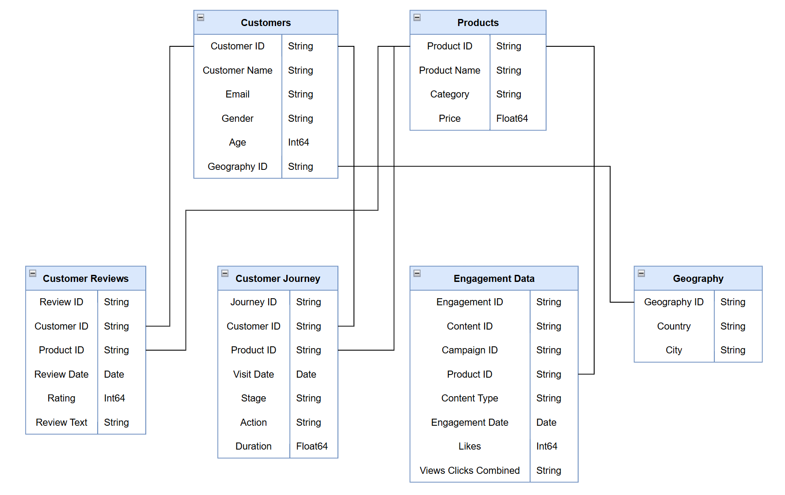
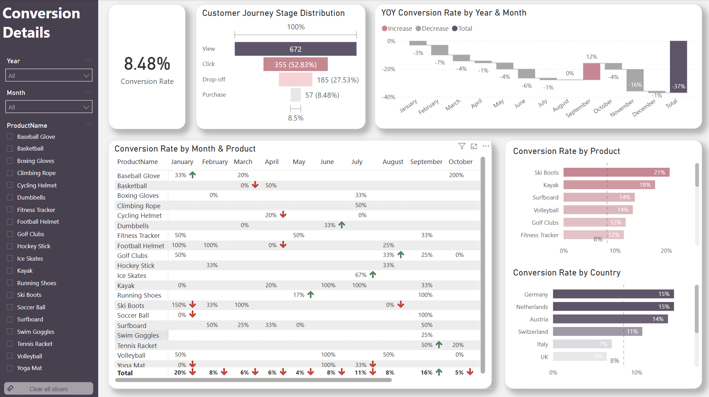
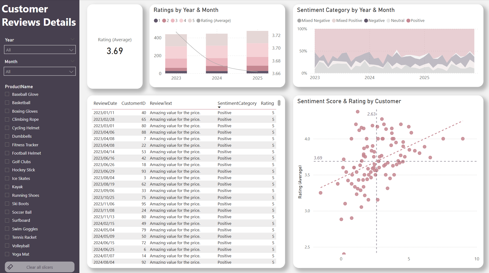

# EasyGoShop Marketing Analysis （2023-2025）

## Table of Contents

- [Project Background](#project-background)
- [Executive Summary](#executive-summary)
- [Insights Deep-Dive](#insights-deep-dive)
    - [Conversion Rates and Trends](#Conversion-Rates-and-Trends)
    - [Key Product Performance](#key-product-performance)
    - [Customer Growth and Repeat Purchase Trends](#customer-growth-and-repeat-purchase-trends)
    - [Loyalty Program Performance](#loyalty-program-performance)
    - [Sales by Platforms & Channels](#sales-by-platforms--channels)
    - [Refund Rate Trends](#refund-rate-trends)
- [Recommendations](#recommendations)
- [Assumptions and Caveats](#assumptions-and-caveats)

***

 

## Project Background

EasyGoShop, an online retail business based on Europe, is facing reduced customer engagement and conversion rates despite launching several new online marketing campaigns. I'm partnering with the Marketing Manager and Customer Experience Manager to extract insights and deliver recommendations to improve performance across sales, product, and marketing teams.

  

## Executive Summary

EasyGoShop's 2023–2025 customer behavior and marketing analysis shows a high volatility in engagement and conversion rates with January yielding the highest conversion rate of 17.31% driven by seasonal purchases of ski boots and October being the worst at 6.15%. The Hockey Sticks product was the most successful, with a high of 57.14% conversion in December, while Swim Goggles performed poorly. Geographically, Germany and the Netherlands lead with 15% conversion, while Spain, Belgium, and France trail at 5%, which also identifies areas of potential localization opportunity. The blog site is viewed extensively but has poor user engagement, though video content holds the highest like-to-view ratio. Campaign analysis shows Campaign 15 performing exceptionally well compared to others, whereas Campaigns 1 and 10 did not generate engagement. Customer sentiment is generally positive (840 of 1,300 reviews), but mixed feedback gives a distinct call for service improvement. EasyGoShop can drive expansion by entering underpenetrated European markets, localizing campaigns, highlighting top-performing products seasonally, and investing in short-form video marketing campaigns on social media to spur renewed engagement.

EasyGoShop Dataset ERD

   

## Insights Deep-Dive {#insights-deep-dive}

### Conversion Rates and Trends
#### Decreased Conversion Rates
Conversion rates also fluctuated at various times throughout the year, as more products converted in months like February and July. This reflects that some products had obvious seasonal peaks, but there could be potential to enhance conversions for poor-performing months with particular interventions.

#### Highest and Lowest Performing Month
January recorded the highest overall conversion rate at 17.31% of 3 years, driven significantly by the Ski Boots with a remarkable 100% conversion. This can be taken as a sign of a positive start to the year and can be attributed to seasonality and successful marketing efforts. 

October saw the lowest overall conversion rate at 6.15%, with no products standing out significantly in terms of conversion. This would indicate that perhaps there may need to be a reevaluation of marketing strategy or promotion during this period to enhance performance.

#### Highest and Lowest Performing Products
Hockey Stick has the highest conversion rates at 15.46% of all time, driven significantly by December, when the conversion rate is 57.14%. This indicates a strong pre-holiday purchase effect and indoor hockey due to winter training. Swim Goggles has the lowest conversion rate at 5.62%.

#### Highest and Lowest Performing Countries
Germany and the Netherlands recorded the highest conversion rates of 15% showing superb market penetration as well as successful targeting strategies in these countries. Spain, Belgium, and France, on the other hand, recorded the lowest conversion rate at a paltry 5%, which could also indicate local engagement or marketing failings. Further, most countries are still untouched by EasyGoShop, indicating immense opportunities for geographic growth as well as transactional expansion in the future.

Conversion Rates Dashboard

### Customer Engagement
#### Declining Views
Views were most elevated in February and July but dropped from August and beyond, indicating lesser audience engagement during the second half of the year.

#### Low Interaction Rates
Clicks and likes remained consistently low compared to views, suggesting a mismatch between content and audience interest. This indicates the need for more engaging content or stronger calls to action.

#### Content Type Performance
Blog content drove the most views, especially in April and July, while social media and video content maintained steady but slightly lower engagement. But video resulted a highest like-to-view ratio, which indicates an improvement for the social media strategies. 

#### Campaign Performance
Campaign 15 produced the biggest amount of views and likes, due to the highest amount of campaigns and specific promotion strategies. Campaign 1 and Campaign 10 resulted low views and likes even with a certain amount of campaigns, indicating a change for campaign strategies.

Social Media Details Dashboard

### Customer Feedback Analysis
#### Customer Ratings Distribution
The majority of customer reviews are in the higher ratings, with 431 reviews at 4 stars and 409 reviews at 5 stars, indicating overall positive feedback. Lower ratings (1-2 stars) account for a smaller proportion, with 80 reviews at 1 star and 153 reviews at 2 stars.

#### Sentiment Analysis
Positive sentiment dominates with 840 reviews, reflecting a generally satisfied customer base. Negative sentiment is present in 226 reviews, with a smaller number of mixed and neutral sentiments, suggesting some areas for improvement but overall strong customer approval.

#### Opportunity for Improvement
The presence of mixed positive and mixed negative attitudes suggests that it may be possible to turn those mixed experiences more into positively labeled ones, perhaps enhancing overall ratings. Addressing specifically the concerns listed in mixed reviews can enhance customer satisfaction.

Customer Reviews Dashboard

  

## Recommendations

### Increase Conversion Rates
Target High-Performing Product Categories: Focus marketing efforts on products with demonstrated high conversion rates, such as Hockey Sticks, Ski Boots, and Baseball Gloves. Implement seasonal promotions or personalized campaigns during peak months (e.g., January and September) to capitalize on these trends.

To address the low conversion rates countries, EasyGoShop can benefit from using a localized marketing strategy tailored to local likes and purchasing behavior. This could include translating content into local languages, product recommendation calibration based on local trends, and collaboration with regional influencers or portals to establish trust. In addition, adopting successful strategies by top-performing countries like Germany and the Netherlands—like targeted email campaigns or retargeting banner ads—can make an impact on replicable solutions for bottom-performing markets. Beyond improving current performance, EasyGoShop could also explore expanding into other untapped European countries, offering new avenues for customer acquisition and revenue growth.

### Enhance Customer Engagement
#### Revitalize Content Strategy
To turn around declining views and low interaction rates, experiment with more engaging content formats, such as interactive videos or user-generated content. Additionally, boost engagement by optimizing call-to-action (CTA) placement in social media and blog content, particularly during historically lower-engagement months (September-December).

#### Video Marketing
To capitalize on video’s strong engagement performance, EasyGoShop should adopt a multi-format strategy combining long-form YouTube content—such as product tutorials, seasonal guides, and customer testimonials—with short-form videos for TikTok and Instagram Reels that highlight quick tips, product teasers, and user-generated content. Content should be data-driven, focusing on top-converting products (e.g., Hockey Sticks, Ski Boots) and common themes surfaced through sentiment analysis of customer reviews. Each video should feature clear, funnel-aligned calls to action (e.g., “Shop now” or “Swipe up to buy”), with tracked links to attribute traffic and measure conversion effectiveness.

#### Campaign Optimization
Focus more on campaigns with high performance, such as Campaign 15 and 13, and retire low-performing campaigns (1 & 10). Replicate successful elements from Campaign 15 in future campaigns

### Improve Customer Engagement
#### Improve Customer Feedback Scores
Address Mixed and Negative Feedback: Implement a feedback loop where mixed and negative reviews are analyzed to identify common issues. Develop improvement plans to address these concerns. Consider following up with dissatisfied customers to resolve issues and encourage re-rating, aiming to move average ratings closer to the 4.0 target.

#### Encourage Positive Feedback
Offer some promotions like coupon and gifts to Incentivize satisfied customers to share positive feedback.

***

## Clarifying Questions, Assumptions, and Caveats
### Questions for Stakeholders Prior to Project Advancement
- Purchase and Drop-off in the customers table
    - How is this data recorded, and what does it specifically represent?
    - Is there any chance that customers would purchase directly with dropping off? 
- Duration in the `Customer_Journey` table
    - What does it specifically represent?
    - What is the unit of the data?
    - How is this data recorded? Would Duration be recounted when `Action` changed? 
- Views Clicks Combined in the `Engagement_Data` table
    - Which numbers represent clicks? And which numbers represent `Views`?

### Assumptions and Caveats
- Customer Purchase Path
    - Customer is required to drop off first then can they pay for this product. Therefore, there is no chance to purcahse directly without dropping off, which means the conversion rate calculation is reasonable.
- Duration of `Customer_Journey`
    - Assumed to represent discrete time (in seconds) for each stage in the journey (e.g., viewing, clicking, purchasing).
    - Duration is not cumulative across the funnel; instead, it reflects the time spent at each stage independently.
- Engagement Data Format
    - Engagement data appears as a `Views-Clicks` format (e.g., "1200-89"). Values before the hyphen represent `Views`; values after represent `Clicks`.
- Limitations
    - No sales and financial data provided (e.g., revenue, CAC, ROI), which would improve the impact analysis of campaigns or conversion strategies.
    - Data doesn’t clarify whether some views or purchases are duplicated by the same customer or are session-unique.

***

- See my cleaning and analysis in the [SQL file](Exploration/SQL/).
- See my sentiment analysis in the [Python Notebook](Exploration/Python/).
- See my data visualizations and dashboards in the [Power BI file](Exploration/PowerBI/).
